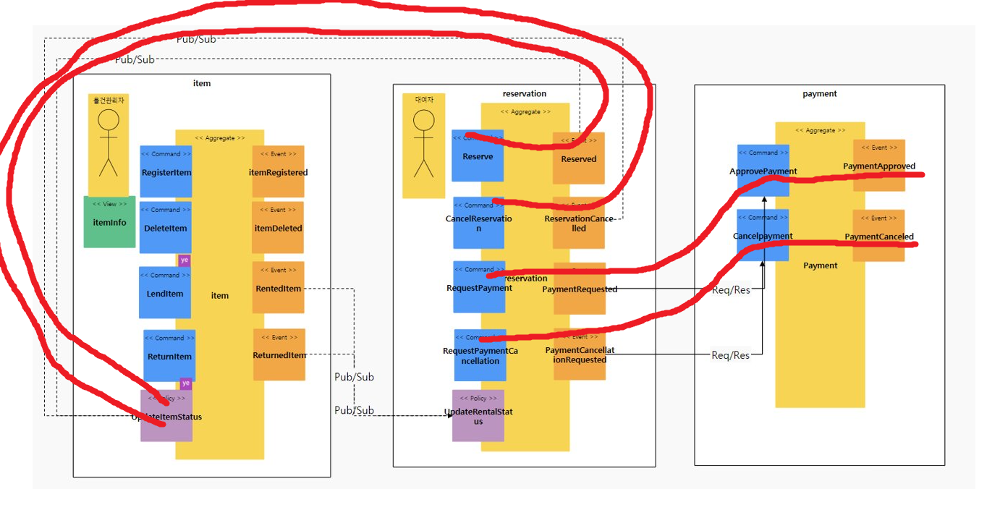
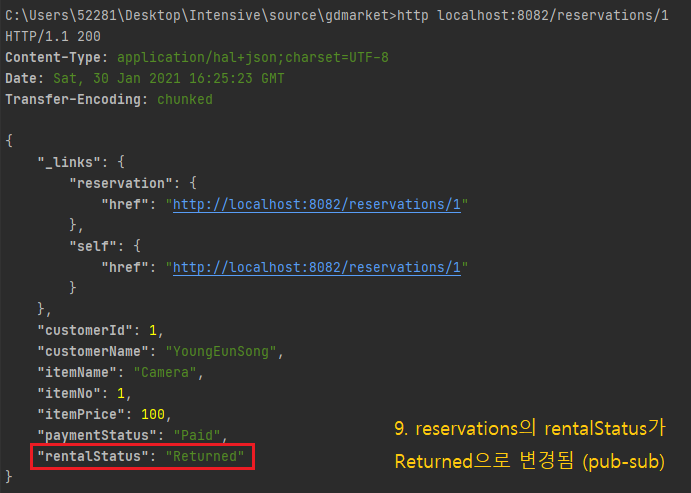

# GDmarket
GDmarket : 근대마켓 - 근거리 대여 마켓


# Table of contents
- 근대마켓
   - [서비스 시나리오](#서비스-시나리오)
   - [체크포인트](#체크포인트)
   - [분석/설계](#분석설계)
        - [AS-IS 조직 (Horizontally-Aligned)](#AS-IS-조직-Horizontally-Aligned)
        - [TO-BE 조직 (Vertically-Aligned)](#TO-BE-조직-Vertically-Aligned)
        - [Event Storming 결과](#Event-Storming-결과)
        - [헥사고날 아키텍처 다이어그램 도출 (Polyglot)](#헥사고날-아키텍처-다이어그램-도출-Polyglot)
   - [구현](#구현)
      - [DDD의 적용](#DDD의-적용)
      - [폴리글랏 퍼시스턴스](#폴리글랏-퍼시스턴스)
      - [Gateway 적용](#Gateway-적용)
      - [동기식 호출과 Fallback 처리](#동기식-호출과-Fallback-처리)
      - [비동기식 호출 / 시간적 디커플링 / 장애격리](#비동기식-호출--시간적-디커플링--장애격리)
      - [CQRS 포함 시나리오 구현 검증](#CQRS-포함-시나리오-구현-검증)
   - [운영](#운영)
      - [Deploy / Pipeline](#Deploy--Pipeline)
      - [CirCuit Breaker](#CirCuit-Breaker)
      - [오토스케일 아웃](#오토스케일-아웃)
      - [무정지 재배포](#무정지-재배포)
      - [Config Map](#Config-Map)
      - [Self-healing (Liveness Probe)](#Self-healing-Liveness-Probe)


# 서비스 시나리오

기능적 요구사항
1. 물건관리자는 물건을 등록할 수 있다
2. 물건관리자는 물건을 삭제할 수 있다.
3. 대여자는 물건을 선택하여 예약한다.
4. 대여자는 예약을 취소할 수 있다.   
5. 예약이 완료되면 해당 물건은 대여불가 상태로 변경된다.
6. 대여자가 결제한다.
7. 대여자는 결제를 취소할 수 있다.
8. 물건관리자는 물건을 대여해준다.
9. 대여자가 대여요청을 취소할 수 있다.
10. 물건이 반납되면 물건은 대여가능 상태로 변경된다.
11. 물건관리자는 물건 통합상태를 중간중간 조회할 수 있다.


비기능적 요구사항
1. 트랜잭션
    1. 결제승인이 되지 안은 건은 결제요청이 완료되지 않아야한다. Sync 호출
2. 장애격리
    1. 물건관리시스템이 수행되지 않더라도 대여 요청은 365일 24시간 받을 수 있어야 한다. > Async (event-driven), Eventual Consistency
    1. 결제시스템이 과중되면 주문을 잠시동안 받지 않고 결제를 잠시후에 하도록 유도한다> Circuit breaker, fallback
3. 성능
    1. 물건관리자가 등록한 물건의 통합상태를 별도로 확인할 수 있어야 한다.> CQRS


# 체크포인트

1. Saga
1. CQRS
1. Correlation
1. Req/Resp
1. Gateway
1. Deploy/ Pipeline
1. Circuit Breaker
1. Autoscale (HPA)
1. Zero-downtime deploy (Readiness Probe)
1. Config Map/ Persistence Volume
1. Polyglot
1. Self-healing (Liveness Probe)


# 분석/설계


## AS-IS 조직 (Horizontally-Aligned)


## TO-BE 조직 (Vertically-Aligned)


## Event Storming 결과
* MSAEz 로 모델링한 이벤트스토밍 결과:  http://www.msaez.io/#/storming/jF5FVdhZRTaLAtq1ZhWOo6aMi0X2/mine/dcfc80f0cee2bfa743d5c53b608d42c6


### 이벤트 도출


### 부적격 이벤트 탈락


    - 과정중 도출된 잘못된 도메인 이벤트들을 걸러내는 작업을 수행함
	- 물건목록조회됨, 물건대여상태조회됨  :  UI 의 이벤트이며 Domain의 상태변화가 없는 이벤트로 제외 아니라서 제외


### 액터, 커맨드 부착하여 읽기 좋게


### 어그리게잇으로 묶기


    - 물건, 예약, 결제 어그리게잇을 생성하고 그와 연결된 command 와 event 들에 의하여 트랜잭션이 유지되어야 하는 단위로 그들 끼리 묶어줌

### 바운디드 컨텍스트로 묶기


    - 도메인 서열 분리 
        - Core Domain:  item, reservation : 없어서는 안될 핵심 서비스이며, 연견 Up-time SLA 수준을 99.999% 목표, 배포주기는 item, reservation 의 경우 1주일 1회 미만
        - Supporting Domain: -- : 경쟁력을 내기위한 서비스이며, SLA 수준은 연간 60% 이상 uptime 목표, 배포주기는 각 팀의 자율이나 표준 스프린트 주기가 1주일 이므로 1주일 1회 이상을 기준으로 함.
        - General Domain:  pay : 결제서비스로 3rd Party 외부 서비스를 사용하는 것이 경쟁력이 높음 

### 폴리시 부착 (괄호는 수행주체, 폴리시 부착을 둘째단계에서 해놔도 상관 없음. 전체 연계가 초기에 드러남)


### 폴리시의 이동과 컨텍스트 매핑 (점선은 Pub/Sub, 실선은 Req/Resp)


    - 컨텍스트 매핑하여 묶어줌.	

### 완성된 모형


    - View Model 추가

### 기능적 요구사항 검증



   	- 물건관리자가 물건을 등록한다. (ok)
    - 물건관리자는 물건을 삭제할 수 있다. (ok)
   	- 대여자는 물건을 선택하여 예약한다. (ok)
    - 대여자는 예약을 취소할 수 있다. (ok)
    - 대여자가 예약을 취소할 수 있다. (ok)
    - 예약이 완료되면 해당 물건은 대여불가 상태로 변경된다. (ok)
	- 대여자는 결제한다. (ok)
    - 대여자는 결제를 취소할 수 있다. (ok)
	


	- 물건관리자는 물건을 대여해준다. (ok)
    - 물건이 반납되면 물건은 대여가능 상태로 변경된다. (ok)


	- 물건관리자는 물건의 통합상태를 조회할 수 있다. (ok)


### 비기능 요구사항 검증


    - 1) 결제승인이 되지 안은 건은 결제요청이 완료되지 않아야한다. (Req/Res)
    - 2) 물건관리시스템이 수행되지 않더라도 대여 요청은 365일 24시간 받을 수 있어야 한다. (Pub/sub)
    - 3) 결제시스템이 과중되면 주문을 잠시동안 받지 않고 결제를 잠시후에 하도록 유도한다. (Circuit breaker)
    - 4) 물건관리자가 등록한 물건의 통합상태를 별도로 확인할 수 있어야 한다. (CQRS, DML/SELECT 분리)


## 헥사고날 아키텍처 다이어그램 도출 (Polyglot)


    - Chris Richardson, MSA Patterns 참고하여 Inbound adaptor와 Outbound adaptor를 구분함
    - 호출관계에서 PubSub 과 Req/Resp 를 구분함
    - 서브 도메인과 바운디드 컨텍스트의 분리:  각 팀의 KPI 별로 아래와 같이 관심 구현 스토리를 나눠가짐
    - Payment의 경우 Polyglot 검증을 위해 Hsql로 셜계


# 구현

서비스를 로컬에서 실행하는 방법은 아래와 같다 (각자의 포트넘버는 8081 ~ 808n 이다)

```
cd item
mvn spring-boot:run

cd reservation
mvn spring-boot:run 

cd payment
mvn spring-boot:run  
```

## DDD의 적용

각 서비스에서 도출된 핵심 aggregate 객체를 entity 로 선언하였다. 아래 캡처의 item 마이크로 서비스가 그 예시이다.


Entity Pattern 과 Repository Pattern 을 적용하여 JPA 를 통하여 다양한 데이터소스 유형 (RDB or NoSQL) 에 대한 별도의 처리가 없도록 데이터 접근 어댑터를 자동 생성하기 위하여 Spring Data REST 의 RestRepository 를 적용하였다


## 폴리글랏 퍼시스턴스
item 서비스와 reservation 서비스는 H2 DB로 구현하고, 그와 달리 payment 서비스의 경우 Hsql으로 구현하여, MSA간 서로 다른 종류의 DB간에도 문제 없이 동작하여 다형성을 만족하는지 확인하였다.

item, reservation 서비스의 pom.xml 설정


payment 서비스의 pom.xml 설정


## Gateway 적용

gateway > applitcation.yml 설정


gateway 테스트

```
http http://gateway:8080/reservations
```


## 동기식 호출과 Fallback 처리

설계에서, 아래의 두 가지 호출은 동기식 호출을 이용하여 일관성을 유지도록 하였다. 

- "예약 시스템의 결제 요청" > "결제 시스템의 결제 승인" 
- "예약 시스템의 결제 취소 요청" > "결제 시스템의 결제 취소"

호출 프로토콜은 앞서 작성한 REST Repository 에 의해 노출되어있는 REST 서비스를 FeignClient 를 이용하여 호출하도록 구현 하였다.

- 결제서비스를 호출하기 위하여 FeignClient 를 이용하여 Service 대행 인터페이스 (Proxy) 를 구현
```java
// reservation > external > PaymentService.java

@FeignClient(name="payment", url="${api.payment.url}")
public interface PaymentService {

    @RequestMapping(method= RequestMethod.POST, path="/payments")
    public void approvePayment(@RequestBody Payment payment);

    @RequestMapping(method= RequestMethod.DELETE, path="/payments/{paymentNo}")
    public void cancelPayment(@PathVariable("paymentNo") Integer paymentNo);
}
```


- 결제 요청을 동기 호출로 받으면 결제 승인 처리
```java
// payment > Payment.java (Entity)

    @PostPersist
    public void onPostPersist(){

        if ("Paid".equals(paymentStatus) ) {
            System.out.println("=============결제 승인 처리중=============");
            PaymentApproved paymentCompleted = new PaymentApproved();

            paymentCompleted.setPaymentStatus("Paid");
            paymentCompleted.setReservationNo(reservationNo);
            paymentCompleted.setItemNo(itemNo);
            paymentCompleted.setItemPrice(itemPrice);

            BeanUtils.copyProperties(this, paymentCompleted);
            paymentCompleted.publishAfterCommit();

			System.out.println("=============결제 승인 완료=============");
        }
    }
	
```


- 동기식 호출이 적용되서 reservation 시스템과 payment 시스템이 일관성을 갖게 됨 
```
# items 등록
http POST localhost:8081/items/ itemName=Camera itemPrice=100 itemStatus=Rentable rentalStatus=NotRenting
	
# 예약 하기
http POST localhost:8082/reservations customerName=YoungEunSong customerId=1 itemNo=1 itemName=Camera itemPrice=100 paymentStatus=NotPaid rentalStatus=NotRenting

# reservation 서비스에서 결제 요청
http PATCH localhost:8082/reservations/1 paymentStatus=Paid
```

```
# payment 서비스에 결제 내역 생성확인
http localhost:8083/payments
```


- 동기식 호출이 적용되서 payment 시스템에 장애가 있으면, reservation의 결제 요청이 불가능

```
# payment 서비스 중단 후 다시 reservation 서비스에서 결제 요청 -> 500 Error
http PATCH localhost:8082/reservations/2 paymentStatus=Paid
```


## 비동기식 호출 / 시간적 디커플링 / 장애격리


'예약됨(Reserved)', '예약취소됨(ReservationCancelled)', '대여됨(RentedItem)', '반납됨(ReturnedItem' 이벤트는 비동기식으로 각각 처리한다. 아래 예시는 그 중 '예약됨(Reserved)' 이벤트에 관한 내용이다.

- '예약됨(Reserved)' 이벤트를 카프카로 송출한다(Publish)


- 물건관리자는 '예약됨(Reserved)' 이벤트를 수신하여 자신의 정책을 처리하도록 PolicyHandler 를 구현한다.
- 물건관리자는 이벤트로부터 수신받은 '물건상태' 정보를 item의 ItemStatus에 저장한다.
- 물건은 특정 인물에게 예약되었으므로, 더이상 다른 사람들에게는 대여불가능(NotRentable)하다는 정보를 갖게 된다. 


reservation 서비스는 item 서비스와 완전히 분리되어있으며(sync transaction 없음) 이벤트 수신에 따라 처리되기 때문에, item 서비스가 유지보수로 인해 잠시 내려간 상태라도 예약을 진행해도 문제 없다.(시간적 디커플링):
```
# items 등록
http POST localhost:8081/items/ itemName=Camera itemPrice=100 itemStatus=Rentable rentalStatus=NotRenting
	
# item 서비스를 내려놓은 후 reservation 서비스에서 예약 하기
http POST localhost:8082/reservations customerName=YoungEunSong customerId=1 itemNo=1 itemName=Camera itemPrice=100 paymentStatus=NotPaid rentalStatus=NotRenting
```

```
# item 서비스 기동
cd item
mvn spring-boot:run

# 예약한 item 의 itemStatus가 NotRentable로 바뀌었는지 확인 (pub/sub)
http localhost:8081/items/1 
```


## CQRS 포함 시나리오 구현 검증
```
# items 등록
http POST localhost:8081/items/ itemName=Camera itemPrice=100 itemStatus=Rentable rentalStatus=NotRenting
```

```
# 예약
http POST localhost:8082/reservations customerName=YoungEunSong customerId=1 itemNo=1 itemName=Camera itemPrice=100 paymentStatus=NotPaid rentalStatus=NotRenting
```

```
# 예약한 item의 itemStatus가 NotRentable로 바뀌었는지 확인 (pub/sub)
http localhost:8081/items/1 
```

```
# 결제요청 
http PATCH localhost:8082/reservations/1 paymentStatus=Paid
```

```
# payments 생성 되어있는지 확인 (req/res)
http localhost:8083/payments
```

```
# 대여 
http PATCH localhost:8081/items/1 itemNo=1 reservationNo=1 itemStatus=NotRentable rentalStatus=Renting 
```

```
# reservations의 rentalStatus가 Renting으로 변경되었는지 확인 (pub/sub)
http localhost:8082/reservations/1
```

```
# 반납 
http PATCH localhost:8081/items/1 itemNo=1 reservationNo=1 itemStatus=Rentable rentalStatus=Returned
```

```
# reservations의 rentalStatus가 Returned으로 변경되었는지 확인 (pub/sub)
http localhost:8082/reservations/1
```

```
# CQRS의 적용, view를 통해 item과 reservation의 정보를 한 번에 확인
http localhost:8081/itemInfoes
```


# 운영

## Deploy / Pipeline

- 네임스페이스 만들기
```
kubectl create ns gdmarket
kubectl get ns
```


- 폴더 만들기, 해당폴더로 이동
```
mkdir gdmarket
cd gdmarket
```


- 소스 가져오기
```
git clone https://github.com/0is2/GDmarket.git
```


- 빌드하기
```
cd item
mvn package -Dmaven.test.skip=true
```


- 도커라이징: Azure 레지스트리에 도커 이미지 푸시하기
```
az acr build --registry gdmarketacr --image gdmarketacr.azurecr.io/item:0.1 .
```


- 컨테이너라이징: 디플로이 생성 확인
```
kubectl create deploy item --image=gdmarketacr.azurecr.io/item:0.1 -n gdmarket
```


- 컨테이너라이징: 서비스 생성 확인
```
kubectl expose deploy item --type="ClusterIP" --port=8080 -n gdmarket
```


- reservation, payment, gateway에도 동일한 작업 반복


#pipe line 

Pipelines


Releases


-(별첨)deployment.yml을 사용하여 배포

- deployment.yml 편집
```
1. namespace, image 설정
2. env 설정 (config Map) 
3. readiness 설정 (무정지 배포)
4. liveness 설정 (self-healing)
5. resource 설정 (autoscaling)
```

- deployment.yml로 서비스 배포
```
kubectl apply -f kubernetes/deployment.yml
```


## CirCuit Breaker

* CirCuit Breaker Framework : Spring FeignClient + Hystrix 사용
* Reservation -> Payment 와의 Req/Res 연결에서 요청이 과도한 경우 CirCuit Breaker 통한 격리
* Hystrix 설정: 요청처리 쓰레드에서 처리시간이 610 밀리가 초과할 경우 CirCuit Breaker Closing 설정 

Reservation(요청처리 쓰레드)에서 처리시간이 610 밀리가 초과할 경우 CirCuit Breaker Closing 설정 


```
// Reservation 서비스 > application.yml 

  feign:
    hystrix:
      enabled: true

  hystrix:
    command:
      default:
        execution.isolation.thread.timeoutInMilliseconds: 610
```

피호출되는 Payment-Request / Payment-approve 의 부하 처리 - 400 밀리초 + 랜덤으로 220 밀리초 추가되도록 sleep 조정


```java
// Payment 서비스 > Payment.java

	if ("Paid".equals(paymentStatus) ) {
            System.out.println("=============결제 승인 처리중=============");
            PaymentApproved paymentCompleted = new PaymentApproved();

            paymentCompleted.setPaymentStatus("Paid");
            paymentCompleted.setReservationNo(reservationNo);
            paymentCompleted.setItemNo(itemNo);
            paymentCompleted.setItemPrice(itemPrice);

            BeanUtils.copyProperties(this, paymentCompleted);
            paymentCompleted.publishAfterCommit();

            try {
                Thread.currentThread().sleep((long) (400 + Math.random() * 220));
                System.out.println("=============결제 승인 완료=============");
            } catch (InterruptedException e) {
                e.printStackTrace();
            }
        }
```


동시사용자 10명 , 30초 동안 siege 부하 테스트 실시


```
siege -c10 -t30S -r10 -v --content-type "application/json" 'http://reservation:8080/reservations/1 PATCH {"paymentStatus":"Paid"}'
```


부하테스터 siege 툴을 통한 서킷 브레이커 동작 확인:

* 앞서 설정한 부하가 발생하여 Circuit Breaker가 발동, 초반에는 요청 실패처리되었으며 <br> 밀린 부하가 payment에서 처리되면서 다시 요청을 받기 시작함
* 적정 부하량 산출시 black-box Testing 에 의존


## 오토스케일 아웃
reservation 시스템에 대한 replica 를 동적으로 늘려주도록 HPA 를 설정한다. 
설정은 CPU 사용량이 15프로를 넘어서면 replica 를 10개까지 늘려준다:

* reservation > deployment.yml 설정


````
        kubectl autoscale deploy reservation --min=1 --max=10 --cpu-percent=15
```` 


* CirCuit Breaker와 동일한 방법으로 워크로드를 50초 걸어준다.

````
        kubectl exec -it pod/siege-5c7c46b788-4rn4r -c siege -- /bin/bash
	
	siege -c250 -t50S -r1000 -v --content-type "application/json" 'http://reservation:8080/reservations POST { "reservationNo":1, "paymentStatus":"Paid"}'
```` 


* 오토스케일이 어떻게 되고 있는지 모니터링을 걸어둔다:

````
kubectl get deploy reservation -w
````


## 무정지 재배포

* 첫째 무정지 재배포가 100% 되는 것인지 확인하기 위해서 Autoscale 이나 CB 설정을 제거함
* 둘째 ITEM 서비스에 readiness 옵션이 없는 배포 옵션을 가지거나, 아예 배포 설정 옵션이 없는 상황에서.
* 셋째 ITEM 서비스의 버전이 0.2 버전에서 0.3 버전의 이미지를 만들어 ACR에 PUSH함.
  - 배포작업 직전에 seige 로 워크로드를 모니터링 함.
```  
kubectl exec -it siege -- /bin/bash
siege -c100 -t120S -r10 -v --content-type "application/json" 'http://item:8080/items POST {"itemName": "Juice", "itemPrice":100}'
```
  - ITEM 서비스의 버전을 0.2 버전에서 0.3 버전 업데이트 시킴.
```  
kubectl set image deploy item item=skcc10.azurecr.io/item:0.3
```
- readiness 옵션이 없는 경우 배포 중 서비스 요청처리 실패


- deployment.yml에 readiness 옵션을 추가한 배포 옵션을 설정
```
kubectl apply -f kubernetes/deployment.yml
```
  - 배포작업 직전에 seige 로 워크로드를 모니터링 함.
```  
kubectl exec -it siege -- /bin/bash
siege -c100 -t120S -r10 -v --content-type "application/json" 'http://item:8080/items POST {"itemName": "Juice", "itemPrice":100}'
```
  - ITEM 서비스의 버전을 0.3 버전에서 0.2 버전으로 다운그레이드 합.
```  
kubectl set image deploy item item=skcc10.azurecr.io/item:0.2
```
- readiness 옵션을 배포 옵션을 설정 한 경우 배포 중 서비스 요청처리 성공
- Availability: 100.00 % 확인


- 기존 버전과 새 버전의 item pod 공존 중


## Config Map

- application.yml 설정

* default쪽


* docker 쪽


- Deployment.yml 설정


- config map 생성 후 조회
```
kubectl create configmap apiurl --from-literal=url=http://payment:8080
kubectl get configmap apiurl -o yaml
```


## Self-healing (Liveness Probe)

- Liveness Command probe 설정
~~~
nano exec-liveness.yaml
~~~


- /tmp/healthy 파일이 존재하는지 확인하는 설정파일. 5초마다 해당 파일이 있는지 조회, Kubelet이 첫 체크하기 전에 기다리는 시간을 설정한다.


- 파일 설정으로 배포
~~~
kubectl create –f exec-liveness.yaml
~~~


- 결과 확인
~~~
kubectl describe pod liveness-exec
~~~


- 파일이 존재하지 않을 경우, 정상 작동에 문제가 있다고 판단되어
kublet에 의해 자동으로 컨테이너가 재시작 된다.
~~~
kubectl get pod liveness-exec -o wide
~~~

